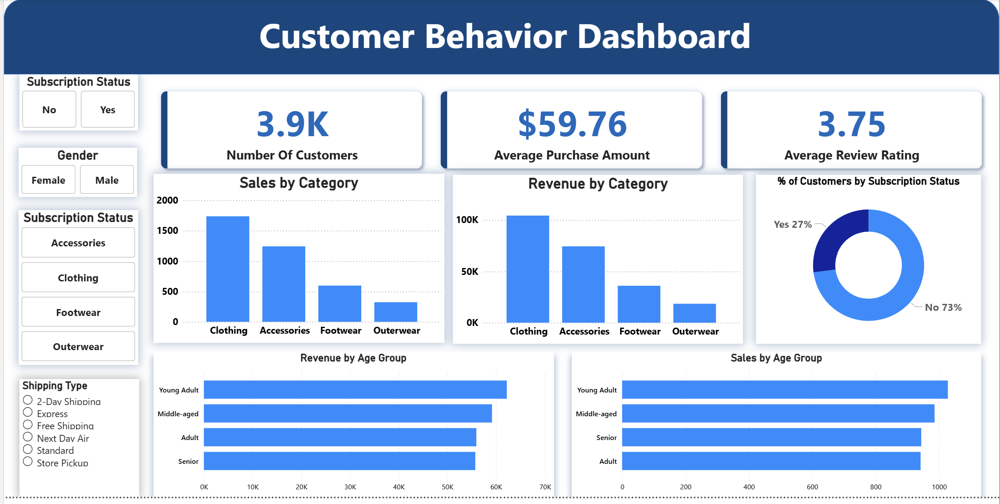

# Customer Shopping Behavior Analysis
Analyzed 3,900 retail transactions with Python, BigQuery, and Power BI to find revenue drivers, margin leaks, and growth levers across customer segments, products, and channels.

## Key Outcomes

- Male customers generate 2.1x female revenue (USD 157,890 vs 75,191), revealing clear upside in the female segment.
- 73% of repeat buyers (5+ purchases) are not subscribed, representing a high-ROI target for loyalty and subscription programs.
- Hat, Sneakers, Coat, Sweater, and Pants rely on 47–50% discounts, suggesting margin erosion and need for pricing tests. 
- Express shipping users show 3.5% higher AOV (USD 60.48 vs 58.46), indicating a premium, convenience-focused segment.
>

## Business Problem
How can the business grow revenue and CLV while protecting margins?
- Who are the most valuable customers by gender, age, location and lifecycle?
- How do discounts, subscriptions, shipping, and payment methods affect profitability and behavior?
- Which products and sizes should be prioritized in marketing, pricing, and inventory decisions?

## Data & Approach

- **Data:** 3,900 transactions, 18 features across customer attributes, transactions, and behavioral metrics.  
- **Tools:** Python (cleaning, feature engineering), BigQuery SQL (segmentation and revenue analysis), Power BI (interactive dashboard).

## Key Insights → Actions

- **Rebalance gender revenue mix**  
  - Insight: Male revenue is 2.1x female.  
  - Action: Expand female assortment and run female-focused campaigns to unlock an estimated USD 30k–40k in additional female revenue.

- **Grow subscriptions from high-frequency buyers**  
  - Insight: Most repeat buyers (5+ purchases) are not subscribed.  
  - Action: Launch frequency-based subscription tiers with exclusive perks, targeting a 25–40% uplift in subscription conversion among high-value customers.

- **Protect margins on discount-heavy SKUs**  
  - Insight: Key products are heavily discounted (47–50%).  
  - Action: Test lower discount depths and shift to bundles/loyalty offers to improve gross margin by 3–5 percentage points.

- **Monetize Express customers**  
  - Insight: Express users have higher AOV than Standard users.  
  - Action: Create a “fast-track” tier with Express shipping, early access, and urgency-based offers to lift AOV by 2–3%.

 ## Role & skills demonstrated
 - **Skills demonstrated:** exploratory data analysis, SQL-based segmentation, cohort analysis, KPI definition, data visualization in Power BI, and translating insights into business recommendations
 - **Role:** end-to-end owner from data cleaning to dashboard and executive summary.
